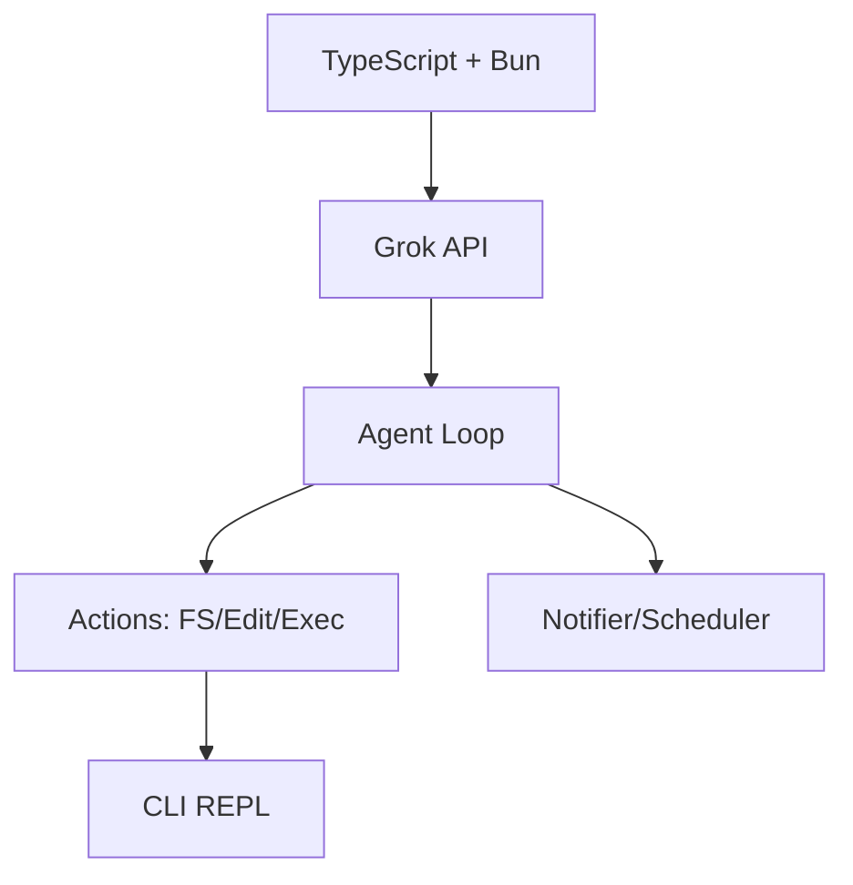

# 🚀 Slashbot: AI-Powered CLI Assistant

[](https://github.com/user/slashbot) [](https://bun.sh) [](https://typescriptlang.org)

**Slashbot** is a lightweight, blazing-fast CLI coding companion powered by the [Grok API](https://x.ai). Alternative to Claude Code—perfect for AI-assisted development, automation, and terminal magic. **v1.0.5**

## ✨ Key Features

| Feature            | Description                                                                |
| ------------------ | -------------------------------------------------------------------------- |
| **Agentic Loop**   | Iterative AI actions: grep, edit, exec, notify—self-correcting workflows   |
| **Code Actions**   | Precise file ops: `[[grep]]`, `[[edit]]`, `[[read]]` with verbatim matches |
| **Streaming Chat** | Real-time Grok responses, vision support, personalities (normal/sarcastic) |
| **Notifications**  | Telegram/WhatsApp alerts, scheduled cron jobs                              |
| **Secure FS**      | No destructives without approval; token-efficient edits                    |
| **Skills**         | `[[skill name="init"]]` for codebase analysis, git context                 |

## 🛠 Tech Stack



- **Runtime**: Bun (compile to binary)
- **Libs**: Telegraf, Clipboardy, Terminal-image
- **Tools**: ESLint, Prettier, tsc

## 📁 Structure

```
slashbot/
├── src/
│   ├── index.ts (REPL entry)
│   ├── api/grok.ts (AI client)
│   ├── actions/* (grep/edit/exec)
│   ├── skills/* (context/project)
│   └── utils/xml.ts (action parse)
├── dist/slashbot (binary)
├── package.json
└── GROK.md (this context)
```

## 🚀 Quick Start

```bash
# Install & Dev
bun install
bun run dev  # Interactive mode

# Build
bun run build  # dist/slashbot

# Usage
./dist/slashbot
> init  # Analyze project
> grep pattern="func" file="*.ts"
```

## 🎨 Conventions

- **Prettier**: 100-char lines, single quotes, semicolons
- **ESLint**: No unused vars, nullish coalescing
- **Rules**: One action/response, grep-first, minimal edits

## 🤖 Example Workflow

```
User: fix bug in src/index.ts
AI: [[grep pattern="bug" file="src/index.ts"]]
   → [[read path="src/index.ts"]]
   → [[edit]]...[[/edit]]
   → [[exec]]bun run typecheck[[/exec]]
```

**Empower your terminal with Slashbot—code smarter, not harder!** 🌟

[GitHub](https://github.com/user/slashbot) | [API Docs](https://x.ai/docs)
