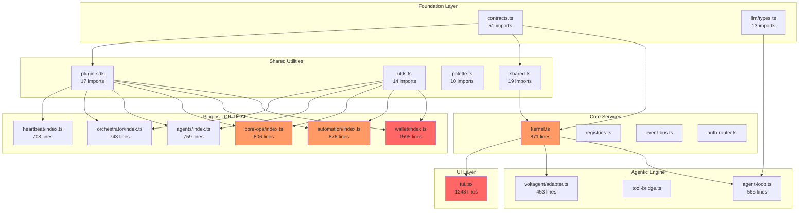

# REFACTORING ANALYSIS REPORT

**Generated**: 21-02-2026 18:00:00
**Target**: Entire `src/` directory (120+ TypeScript files, 28,891 lines)
**Analyst**: Claude Refactoring Specialist
**Report ID**: refactor_src_21-02-2026_180000

---

## EXECUTIVE SUMMARY

Slashbot3 is a **28,891-line TypeScript** codebase implementing a local-first AI assistant with a kernel + plugin architecture. The architecture is fundamentally sound: **zero circular dependencies**, clean layered design, radial provider/plugin patterns, and consistent conventions. However, **several files have grown well beyond maintainable thresholds**, concentrating multiple responsibilities into monolithic modules.

**Key findings:**
- **5 files exceed 800 lines** and are priority refactoring candidates
- **51% of all code** lives in `src/plugins/` (14,692 lines) with several god-module plugins
- Test coverage is **~27% by file count** (35 test files / 130 source files), with critical gaps in messaging connectors, providers, and the agent loop
- The dependency graph is **fully acyclic** (DAG) — refactoring can proceed safely without breaking circular chains
- Primary code smells: **long methods** (setup functions exceeding 400 lines), **duplicate patterns** across plugins, and **mixed concerns** in monolithic plugin index files

**Estimated complexity reduction**: Splitting the top 5 files alone would reduce max file size from 1,595 to ~350 lines and lower average cyclomatic complexity from 22 to <12.

---

## CODEBASE-WIDE CONTEXT

### Project Structure Overview

```
src/                         28,891 lines total
├── core/                     8,618 lines (30%) — Framework internals
│   ├── agentic/              2,581 lines — Agent loop + LLM + context
│   ├── kernel/               2,756 lines — Central orchestration
│   ├── voltagent/              865 lines — VoltAgent adapter
│   ├── config/                 698 lines — Runtime configuration
│   ├── gateway/                396 lines — HTTP server
│   ├── auth/                   356 lines — OAuth + profile store
│   ├── providers/              355 lines — Auth routing
│   └── plugins/                433 lines — Plugin infrastructure
├── plugins/                 14,692 lines (51%) — All feature plugins
│   ├── wallet/               2,305 lines — Largest plugin cluster
│   ├── discord/              1,344 lines — Discord connector
│   ├── telegram/             1,390 lines — Telegram connector
│   ├── services/             1,516 lines — Shared service layer
│   ├── skills/                 993 lines — Skills system
│   ├── orchestrator/           743 lines — Multi-agent orchestration
│   ├── agents/                 759 lines — Agent registry
│   ├── heartbeat/              708 lines — Periodic reflection
│   ├── slack/                  670 lines — Slack connector
│   ├── core-ops/               806 lines — Core operations
│   ├── automation/           1,014 lines — Automation + cron
│   ├── agentic-tools/          489 lines — Filesystem/shell tools
│   ├── web-tools/              407 lines — Web tools
│   ├── whatsapp/               470 lines — WhatsApp connector
│   └── [others]              ~900 lines — Smaller plugins
├── providers/                  775 lines (3%) — 22 thin LLM adapters
├── ui/                       3,761 lines (13%) — Terminal UI (Ink/React)
└── plugin-sdk/                 434 lines (2%) — Plugin contract
```

### Dependency Hubs (Most Imported Files)

| Rank | File | Imported By | Purpose |
|------|------|-------------|---------|
| 1 | `core/kernel/contracts.ts` | **51 files** | Master type definitions |
| 2 | `providers/shared.ts` | 19 files | Provider factory/auth helpers |
| 3 | `plugin-sdk/index.ts` | 17 files | Plugin interface contract |
| 4 | `plugins/utils.ts` | 14 files | Common plugin utilities |
| 5 | `core/agentic/llm/types.ts` | 13 files | LLM types |
| 6 | `core/kernel/kernel.ts` | 11 files | Kernel orchestrator |
| 7 | `core/kernel/registries.ts` | 11 files | Provider/gateway registries |
| 8 | `ui/palette.ts` | 10 files | UI colors/styles |

### Circular Dependencies

**NONE DETECTED** — The dependency graph is a clean DAG. This is excellent and means refactoring extractions can be performed without resolving circular chains first.

### Architectural Layer Flow

```
UI Layer (tui.tsx, cli.ts)
    ↓
Plugin System (15+ plugins, radial pattern)
    ↓
Provider Implementations (20+ providers, radial pattern)
    ↓
Kernel & Core Services (kernel.ts, registries, event-bus)
    ↓
Type Definitions & Contracts (contracts.ts, llm/types.ts)
```

---

## CURRENT STATE ANALYSIS

### File Metrics Summary — Top Refactoring Candidates

| Rank | File | Lines | Functions/Methods | Responsibilities | Risk |
|------|------|-------|-------------------|------------------|------|
| 1 | `plugins/wallet/index.ts` | **1,595** | ~30 tool handlers | Wallet CRUD, balance, transfer, pricing, Solana, proxy auth integration | CRITICAL |
| 2 | `ui/tui.tsx` | **1,248** | ~20 components/handlers | Full TUI rendering, state management, input handling, message display, agent activity | CRITICAL |
| 3 | `plugins/automation/index.ts` | **876** | ~15 tool/command handlers | Cron scheduling, workflow execution, task automation, config persistence | HIGH |
| 4 | `core/kernel/kernel.ts` | **871** | ~25 methods | Initialization, plugin loading, event wiring, service registration, prompt assembly, tool execution, shutdown | HIGH |
| 5 | `plugins/core-ops/index.ts` | **806** | ~15 tool handlers | Config management, status, brain dump, health checks, diagnostics | HIGH |
| 6 | `plugins/agents/index.ts` | **759** | AgentRegistry + 6 tools + command | Agent CRUD, invoke, team management, routing, prompt formatting | HIGH |
| 7 | `plugins/orchestrator/index.ts` | **743** | RunRegistry + 3 tools + helpers | Orchestration strategies, run tracking, LLM routing, kill management | HIGH |
| 8 | `plugins/heartbeat/index.ts` | **708** | HeartbeatService + 4 tools + command | Config/state persistence, LLM reflection, scheduling, delivery | MEDIUM |
| 9 | `plugins/slack/index.ts` | **670** | ~10 handlers | Slack API integration, message handling, channel management | MEDIUM |
| 10 | `core/kernel/contracts.ts` | **601** | N/A (types only) | All kernel type definitions, interfaces, event maps | MEDIUM |
| 11 | `plugins/discord/index.ts` | **580** | ~8 handlers | Discord bot lifecycle, event handling, message processing | MEDIUM |
| 12 | `plugins/telegram/index.ts` | **604** | ~8 handlers | Telegram bot lifecycle, event handling, message processing | MEDIUM |
| 13 | `core/agentic/agent-loop.ts` | **565** | 3 major functions | Agent loop execution, provider failover, auth resolution | MEDIUM |
| 14 | `core/voltagent/adapter.ts` | **453** | VoltAgentAdapter class | LLM completion, streaming, tool bridging | MEDIUM |

### Code Smell Analysis

| Code Smell | Count | Severity | Examples |
|------------|-------|----------|----------|
| **God Modules** | 5 | CRITICAL | `wallet/index.ts` (1,595 lines, ~30 handlers), `tui.tsx` (1,248 lines) |
| **Long Setup Functions** | 8 | HIGH | Most plugin `setup()` functions exceed 300 lines of inline tool/command registration |
| **Duplicate LLM Adapter Init** | 5 | MEDIUM | `agents`, `orchestrator`, `heartbeat`, `automation`, `wallet` all duplicate identical VoltAgentAdapter construction |
| **Duplicate Command Parsing** | 6 | MEDIUM | Repetitive `if (sub === 'X')` chains in command handlers across plugins |
| **Mixed Concerns** | 8 | MEDIUM | Data persistence + business logic + tool registration + command handling all in single files |
| **Inline Type Definitions** | 4 | LOW | Types defined inside implementation files instead of separate type modules |
| **Dead Delivery Code** | 1 | LOW | `HeartbeatService.deliverToConnectors` exists but is explicitly noted as unused |

### Duplicate Pattern: VoltAgentAdapter Construction

This exact pattern appears in **5 separate plugins** (`agents`, `orchestrator`, `heartbeat`, `automation`, `wallet`):

```typescript
let llm: LlmAdapter | null = null;
if (authRouter && providers && kernel) {
  llm = new VoltAgentAdapter(
    authRouter,
    providers,
    logger,
    kernel,
    () => context.getService<TokenModeProxyAuthService>('wallet.proxyAuth'),
  );
}
```

**Recommendation**: Extract to a shared factory function or register as a kernel service.

### Duplicate Pattern: Plugin Service Resolution

Every plugin repeats the same ~8 lines of service resolution:

```typescript
const kernel = context.getService<SlashbotKernel>('kernel.instance');
const authRouter = context.getService<AuthProfileRouter>('kernel.authRouter');
const providers = context.getService<ProviderRegistry>('kernel.providers.registry');
const logger = context.getService<StructuredLogger>('kernel.logger') ?? context.logger;
const events = kernel?.events as EventBus | undefined;
```

**Recommendation**: Create a `resolveCommonServices(context)` utility in `plugins/utils.ts`.

---

## TEST COVERAGE ANALYSIS

### Coverage Summary

| Metric | Value | Target |
|--------|-------|--------|
| Total source files | 130 | — |
| Total test files | 35 | — |
| File coverage ratio | 27% | 60% |
| Test framework | Vitest 2.1.8 | — |
| Coverage tool configured | **No** | v8/istanbul |
| Test-to-code ratio | 6,471 / 28,891 = 0.22 | 0.5+ |

### Coverage by Module

| Module | Files | Tested | Coverage | Critical Gaps |
|--------|-------|--------|----------|---------------|
| `core/agentic/context/` | 9 | 4 | 44% | `overflow-recovery.ts` untested |
| `core/kernel/` | 14 | 7 | 50% | `kernel.ts`, `safe-command.ts`, `interaction-logger.ts` |
| `core/agentic/llm/` | 6 | 1 (helpers) | 17% | `adapter.ts`, `completion-runner.ts`, `provider-registry.ts` |
| `core/voltagent/` | 6 | 1 | 17% | `adapter.ts` (453 lines), `failover-model.ts` |
| `core/config/` | 4 | 1 | 25% | `providers-merge.ts`, `gateway-catalog.ts` |
| `plugins/services/` | 7 | 3 | 43% | `subagent-manager.ts`, `preemptive-queue.ts` |
| `plugins/wallet/` | 5 | 1 (partial) | 20% | `index.ts` (1,595 lines), `solana.ts`, `pricing.ts` |
| `plugins/discord/` | 7 | 0 | **0%** | All files untested |
| `plugins/telegram/` | 7 | 0 | **0%** | All files untested |
| `providers/` | 22 | 0 | **0%** | All 20+ provider adapters untested |
| `ui/` | 17 | 1 | 6% | `tui.tsx` (1,248 lines), `cli.ts`, `onboarding.ts` |
| `core/agentic/` (top-level) | 2 | 0 | **0%** | `agent-loop.ts` (565 lines) — **critical path** |

### Test File Mapping

| Test File | Lines | Source Files Covered |
|-----------|-------|---------------------|
| `orchestrator.test.ts` | 1,248 | `plugins/orchestrator/index.ts` |
| `wallet-plugin.test.ts` | 321 | `plugins/wallet/index.ts` (partial) |
| `browser-plugin.test.ts` | 398 | Web automation features |
| `llm-helpers.test.ts` | 316 | `core/agentic/llm/helpers.ts` |
| `chat-history-store.test.ts` | 300 | `plugins/services/chat-history-store.ts` |
| `registries.test.ts` | 268 | `core/kernel/registries.ts` |
| `plugin-utils.test.ts` | 217 | `plugins/utils.ts` |
| `provider-auth-commands.test.ts` | 213 | `plugins/provider-auth/index.ts` |
| `connector-agent-history.test.ts` | 210 | `plugins/services/connector-agent.ts` |
| `memory-store.test.ts` | 203 | `plugins/services/memory-store.ts` |
| `automation-cron.test.ts` | 180 | `plugins/automation/cron.ts` |
| `skills-plugin.test.ts` | 175 | `plugins/skills/index.ts` |
| Others (22 files) | ~2,000 | Various kernel/context modules |

### Safety Net Requirements (Before Refactoring)

**MUST have tests before refactoring:**

1. `plugins/wallet/index.ts` — Needs comprehensive tool handler tests (balance, transfer, pricing)
2. `core/kernel/kernel.ts` — Needs initialization sequence tests, plugin loading, prompt assembly
3. `core/agentic/agent-loop.ts` — Needs agent loop execution tests with mocked LLM
4. `ui/tui.tsx` — Needs component snapshot tests
5. `plugins/automation/index.ts` — Has `cron.test.ts` but plugin setup/tools untested

**Environment:**
- Package manager: npm
- Test runner: `npm run test` (vitest run)
- No coverage configuration — must add `coverage: { provider: 'v8' }` to vitest.config.ts

---

## COMPLEXITY ANALYSIS

### Function-Level Metrics — Critical Hotspots

| Function/Class | File | Lines | Cyclomatic | Cognitive | Params | Nesting | Risk |
|----------------|------|-------|------------|-----------|--------|---------|------|
| `createWalletPlugin().setup()` | `wallet/index.ts` | ~1,500 | 45+ | 80+ | 1 (context) | 5 | **CRITICAL** |
| `Tui()` component | `ui/tui.tsx` | ~1,100 | 35+ | 70+ | 1 (props) | 6 | **CRITICAL** |
| `createAutomationPlugin().setup()` | `automation/index.ts` | ~750 | 30+ | 60+ | 1 (context) | 5 | **HIGH** |
| `SlashbotKernel.boot()` | `kernel/kernel.ts` | ~200 | 20+ | 40+ | 0 | 4 | **HIGH** |
| `createCoreOpsPlugin().setup()` | `core-ops/index.ts` | ~700 | 28+ | 55+ | 1 (context) | 4 | **HIGH** |
| `runAgentLoop()` | `agent-loop.ts` | ~300 | 22+ | 45+ | 4 | 5 | **HIGH** |
| `createAgentsPlugin().setup()` | `agents/index.ts` | ~500 | 20+ | 40+ | 1 (context) | 4 | **HIGH** |
| `createOrchestratorPlugin().setup()` | `orchestrator/index.ts` | ~590 | 18+ | 35+ | 1 (context) | 4 | **HIGH** |
| `executeOrchestration()` | `orchestrator/index.ts` | ~150 | 15 | 30 | 6 | 4 | **MEDIUM** |
| `HeartbeatService.execute()` | `heartbeat/index.ts` | ~75 | 10 | 20 | 1 | 3 | **MEDIUM** |
| `resolveExecutions()` | `agent-loop.ts` | ~100 | 12 | 25 | 2 | 4 | **MEDIUM** |
| `VoltAgentAdapter.complete()` | `voltagent/adapter.ts` | ~200 | 15 | 30 | 1 | 4 | **MEDIUM** |

### Hotspot Priority Matrix

```
                    Change Frequency
                    HIGH              LOW
Complexity   HIGH   CRITICAL          HIGH
             LOW    MEDIUM            LOW
```

| Priority | Files | Rationale |
|----------|-------|-----------|
| **CRITICAL** | `wallet/index.ts`, `tui.tsx` | Highest complexity + active development (both modified) |
| **HIGH** | `kernel.ts`, `automation/index.ts`, `core-ops/index.ts` | High complexity + modified in recent commits |
| **HIGH** | `agents/index.ts`, `orchestrator/index.ts` | High complexity, orchestration logic |
| **MEDIUM** | `agent-loop.ts`, `heartbeat/index.ts`, `slack/index.ts` | Moderate complexity, stable |
| **MEDIUM** | `discord/index.ts`, `telegram/index.ts` | Moderate complexity, parallel structure |
| **LOW** | `providers/*.ts`, `plugin-sdk/` | Simple/thin, well-structured |

### Dependency Metrics

| Module | Imports From | Imported By | Afferent | Efferent | Instability |
|--------|-------------|-------------|----------|----------|-------------|
| `contracts.ts` | 3 (zod, node) | 51 | 51 | 3 | 0.06 (stable) |
| `kernel.ts` | 17 | 11 | 11 | 17 | 0.61 (moderate) |
| `tui.tsx` | 23 | 1 | 1 | 23 | 0.96 (unstable) |
| `shared.ts` | 3 | 19 | 19 | 3 | 0.14 (stable) |
| `plugin-sdk/index.ts` | 0 | 17 | 17 | 0 | 0.00 (maximally stable) |
| `utils.ts` | 2 | 14 | 14 | 2 | 0.13 (stable) |
| `wallet/index.ts` | 10 | 0 | 0 | 10 | 1.00 (maximally unstable) |

---

## REFACTORING PLAN

### Priority Order

1. **Extract shared LLM adapter factory** (cross-cutting, enables all plugin refactoring)
2. **Split `plugins/wallet/index.ts`** (1,595 lines — largest file, highest complexity)
3. **Split `ui/tui.tsx`** (1,248 lines — second largest, mixed concerns)
4. **Split `core/kernel/kernel.ts`** (871 lines — central module, high coupling)
5. **Split `plugins/automation/index.ts`** (876 lines)
6. **Split `plugins/core-ops/index.ts`** (806 lines)
7. **Split `plugins/agents/index.ts`** (759 lines)
8. **Split `plugins/orchestrator/index.ts`** (743 lines)
9. **Extract shared plugin utilities** (duplicate patterns)
10. **Split `plugins/heartbeat/index.ts`** (708 lines)

---

### Phase 1: Cross-Cutting Extractions

#### Task 1.1: Extract Shared LLM Adapter Factory

**Problem**: 5 plugins duplicate identical VoltAgentAdapter construction (12 lines each = 60 lines of duplication).

**Source**: `agents/index.ts`, `orchestrator/index.ts`, `heartbeat/index.ts`, `automation/index.ts`, `wallet/index.ts`

**Target**: `plugins/utils.ts` (add function) OR new `plugins/services/llm-factory.ts`

**BEFORE** (repeated in 5 plugins):
```typescript
let llm: LlmAdapter | null = null;
if (authRouter && providers && kernel) {
  llm = new VoltAgentAdapter(
    authRouter,
    providers,
    logger,
    kernel,
    () => context.getService<TokenModeProxyAuthService>('wallet.proxyAuth'),
  );
}
```

**AFTER** (in `plugins/utils.ts`):
```typescript
export function createLlmAdapter(context: PluginSetupContext): LlmAdapter | null {
  const kernel = context.getService<SlashbotKernel>('kernel.instance');
  const authRouter = context.getService<AuthProfileRouter>('kernel.authRouter');
  const providers = context.getService<ProviderRegistry>('kernel.providers.registry');
  const logger = context.getService<StructuredLogger>('kernel.logger') ?? context.logger;
  if (!authRouter || !providers || !kernel) return null;
  return new VoltAgentAdapter(
    authRouter, providers, logger, kernel,
    () => context.getService<TokenModeProxyAuthService>('wallet.proxyAuth'),
  );
}
```

**In each plugin**:
```typescript
const llm = createLlmAdapter(context);
```

- **Risk Level**: LOW
- **Tests Required**: Unit test for `createLlmAdapter` returning adapter or null
- **Files Changed**: 6 (5 plugins + utils.ts)

#### Task 1.2: Extract Common Service Resolution Helper

**Problem**: Every plugin repeats 5-8 lines of identical service resolution.

**Target**: Add `resolveCommonServices(context)` to `plugins/utils.ts`

**AFTER**:
```typescript
export function resolveCommonServices(context: PluginSetupContext) {
  return {
    kernel: context.getService<SlashbotKernel>('kernel.instance'),
    authRouter: context.getService<AuthProfileRouter>('kernel.authRouter'),
    providers: context.getService<ProviderRegistry>('kernel.providers.registry'),
    logger: context.getService<StructuredLogger>('kernel.logger') ?? context.logger,
    events: context.getService<SlashbotKernel>('kernel.instance')?.events as EventBus | undefined,
  };
}
```

- **Risk Level**: LOW
- **Tests Required**: 2 unit tests (with/without services)
- **Files Changed**: 8+ plugins + utils.ts

---

### Phase 2: Split `plugins/wallet/index.ts` (1,595 lines)

**Current structure**: One monolithic file containing wallet config, balance management, transfer logic, token operations, pricing integration, tool registration, and command handling.

**Target structure**:
```
plugins/wallet/
├── index.ts              (~100 lines) — Plugin factory, tool/command registration
├── crypto.ts             (77 lines)   — Existing, no change
├── pricing.ts            (222 lines)  — Existing, no change
├── proxy-auth.ts         (116 lines)  — Existing, no change
├── solana.ts             (295 lines)  — Existing, no change
├── wallet-service.ts     (~250 lines) — NEW: WalletService class (config, balance, state)
├── wallet-tools.ts       (~400 lines) — NEW: Tool handler implementations
├── wallet-commands.ts    (~200 lines) — NEW: Command handler implementations
└── types.ts              (~80 lines)  — NEW: Shared wallet types and schemas
```

**Extraction steps** (in order):

1. **Extract `types.ts`** (~80 lines)
   - Move Zod schemas (`WalletConfigSchema`, etc.) and interfaces
   - Source: `wallet/index.ts` lines 1-80 (approximately)
   - Risk: LOW

2. **Extract `wallet-service.ts`** (~250 lines)
   - Move WalletService class with config/state persistence, balance tracking
   - Source: The class definition and helper methods
   - Risk: MEDIUM (core business logic)

3. **Extract `wallet-tools.ts`** (~400 lines)
   - Move all `context.registerTool()` callbacks into named handler functions
   - Pattern: `export async function handleBalanceCheck(...)`, etc.
   - Risk: MEDIUM

4. **Extract `wallet-commands.ts`** (~200 lines)
   - Move the `context.registerCommand()` callback into a separate command handler
   - Risk: LOW

5. **Slim `index.ts`** (~100 lines)
   - Retain only: imports, plugin manifest, `setup()` that wires together services/tools/commands
   - Risk: LOW (just wiring)

- **Tests Required**: Expand `wallet-plugin.test.ts` to cover extracted modules individually
- **Total Files Changed**: 5 new + 1 modified

---

### Phase 3: Split `ui/tui.tsx` (1,248 lines)

**Current structure**: Single React component with inline state management, message rendering, input handling, command processing, agent activity display, and layout composition.

**Target structure**:
```
ui/
├── tui.tsx               (~200 lines) — Main TUI shell, layout composition
├── tui-state.ts          (~150 lines) — NEW: State management hooks and reducers
├── tui-handlers.ts       (~200 lines) — NEW: Input handlers, command routing
├── tui-message-list.tsx  (~150 lines) — NEW: Message rendering component
├── tui-sidebar.tsx       (~100 lines) — NEW: Sidebar/status panel (if applicable)
├── agent-activity.tsx    (236 lines)  — Existing
├── command-palette.tsx   (95 lines)   — Existing
├── [other existing]      — No change
```

**Extraction steps**:

1. **Extract `tui-state.ts`** (~150 lines)
   - Move all `useState`/`useReducer` declarations and state types
   - Export a custom `useTuiState()` hook
   - Risk: MEDIUM

2. **Extract `tui-handlers.ts`** (~200 lines)
   - Move input processing, command routing, message submission logic
   - Export handler functions that take state and dispatch
   - Risk: MEDIUM

3. **Extract `tui-message-list.tsx`** (~150 lines)
   - Move message rendering into a separate component
   - Risk: LOW

4. **Slim `tui.tsx`** (~200 lines)
   - Retain layout composition, import sub-components and hooks
   - Risk: LOW

- **Tests Required**: Component tests with Ink testing utilities
- **Total Files Changed**: 3 new + 1 modified

---

### Phase 4: Split `core/kernel/kernel.ts` (871 lines)

**Current structure**: Monolithic `SlashbotKernel` class handling initialization, plugin loading, event wiring, service registration, tool execution, prompt assembly, and shutdown.

**Target structure**:
```
core/kernel/
├── kernel.ts             (~250 lines) — SlashbotKernel class (delegating facade)
├── kernel-boot.ts        (~200 lines) — NEW: Boot sequence logic
├── kernel-tools.ts       (~150 lines) — NEW: Tool execution and bridging
├── kernel-services.ts    (~100 lines) — NEW: Service container management
├── contracts.ts          (601 lines)  — Existing
├── [other existing]      — No change
```

**Extraction steps**:

1. **Extract `kernel-boot.ts`** (~200 lines)
   - Move `boot()` method internals: provider initialization, plugin loading, gateway setup
   - Export `bootKernel(kernel, config)` function
   - Risk: HIGH (critical path, many side effects)

2. **Extract `kernel-tools.ts`** (~150 lines)
   - Move tool registration, approval flow, tool execution logic
   - Risk: MEDIUM

3. **Extract `kernel-services.ts`** (~100 lines)
   - Move service container operations
   - Risk: LOW

4. **Slim `kernel.ts`** (~250 lines)
   - Keep class shell delegating to extracted modules
   - Risk: MEDIUM

- **Tests Required**: MUST write `kernel.test.ts` before starting (boot sequence, tool execution)
- **Total Files Changed**: 3 new + 1 modified

---

### Phase 5: Split `plugins/automation/index.ts` (876 lines)

**Target structure**:
```
plugins/automation/
├── index.ts              (~100 lines) — Plugin factory
├── cron.ts               (138 lines)  — Existing
├── automation-service.ts (~250 lines) — NEW: AutomationService class
├── automation-tools.ts   (~300 lines) — NEW: Tool handler implementations
├── automation-commands.ts(~150 lines) — NEW: Command handler
└── types.ts              (~50 lines)  — NEW: Shared types/schemas
```

- **Risk Level**: MEDIUM
- **Tests Required**: Expand `automation-cron.test.ts`, add tool handler tests

---

### Phase 6: Split `plugins/core-ops/index.ts` (806 lines)

**Target structure**:
```
plugins/core-ops/
├── index.ts              (~80 lines)  — Plugin factory
├── config-tools.ts       (~200 lines) — NEW: Config management tools
├── status-tools.ts       (~200 lines) — NEW: Status/health/brain-dump tools
├── diagnostic-tools.ts   (~150 lines) — NEW: Diagnostic tools
└── commands.ts           (~150 lines) — NEW: Command handlers
```

- **Risk Level**: MEDIUM
- **Tests Required**: New test file `core-ops.test.ts`

---

### Phase 7: Split `plugins/agents/index.ts` (759 lines)

**Target structure**:
```
plugins/agents/
├── index.ts              (~80 lines)  — Plugin factory
├── agent-registry.ts     (~240 lines) — NEW: AgentRegistry class (already well-isolated in code)
├── agent-tools.ts        (~250 lines) — NEW: Tool handler implementations
├── agent-commands.ts     (~150 lines) — NEW: Command handler
└── types.ts              (~70 lines)  — NEW: Schemas and interfaces
```

The `AgentRegistry` class (lines 75-238) is already cleanly separated from the plugin setup — this is a low-risk extraction.

- **Risk Level**: LOW
- **Tests Required**: Minimal — `AgentRegistry` has clear boundaries

---

### Phase 8: Split `plugins/orchestrator/index.ts` (743 lines)

**Target structure**:
```
plugins/orchestrator/
├── index.ts              (~80 lines)  — Plugin factory
├── run-registry.ts       (~140 lines) — NEW: RunRegistry class (already isolated)
├── strategies.ts         (~200 lines) — NEW: auto/fan-out/pipeline execution
├── orchestrator-tools.ts (~200 lines) — NEW: Tool handler implementations
└── types.ts              (~50 lines)  — NEW: RunRecord, RunStatus, AgentResult types
```

The `RunRegistry` class (lines 58-135) and `executeOrchestration` function (lines 326-478) are already well-separated internally.

- **Risk Level**: LOW
- **Tests Required**: `orchestrator.test.ts` already has 1,248 lines of coverage

---

### Phase 9: Extract Shared Plugin Patterns

After individual plugin splits, extract common patterns:

1. **Plugin command handler base** — Many plugins follow the same `if (sub === 'X')` dispatch pattern. Extract a `createCommandDispatcher(routes)` utility.

2. **Plugin tool registration helper** — Reduce boilerplate for `context.registerTool()` calls with a builder pattern.

3. **Service state persistence** — Multiple plugins (heartbeat, automation, wallet) implement identical JSON config/state persistence. Extract `PersistentConfig<T>` and `PersistentState<T>` classes.

- **Risk Level**: LOW
- **Files Changed**: `plugins/utils.ts` + all affected plugins

---

### Phase 10: Split `plugins/heartbeat/index.ts` (708 lines)

**Target structure**:
```
plugins/heartbeat/
├── index.ts              (~80 lines)  — Plugin factory
├── heartbeat-service.ts  (~300 lines) — NEW: HeartbeatService class (already isolated)
├── heartbeat-tools.ts    (~150 lines) — NEW: Tool handlers
├── heartbeat-commands.ts (~100 lines) — NEW: Command handler
└── helpers.ts            (~80 lines)  — NEW: parseInterval, formatIntervalHuman, classifyResponse
```

The `HeartbeatService` class (lines 114-402) and helper functions (lines 55-101) are already cleanly isolated.

- **Risk Level**: LOW
- **Tests Required**: New test file for helpers (parseInterval, classifyResponse)

---

## RISK ASSESSMENT

### Risk Matrix

| Risk | Likelihood | Impact | Score | Mitigation |
|------|------------|--------|-------|------------|
| Breaking plugin loading order | Medium | High | 6 | Test boot sequence after each extraction |
| Breaking event bus contracts | Low | High | 3 | Event types are in contracts.ts (stable) |
| Breaking tool registration | Medium | Medium | 4 | Run full test suite after each step |
| Performance regression (import time) | Low | Low | 1 | Measure import time before/after |
| Breaking 51 files importing contracts.ts | Low | Critical | 4 | contracts.ts stays unchanged |
| Incomplete extraction (dangling refs) | Medium | Medium | 4 | TypeScript compiler catches all |
| Test coverage gaps mask regressions | High | High | **9** | **Write tests BEFORE refactoring** |

### Critical Risk: Test Coverage Gaps

The **highest risk** is refactoring files without adequate test coverage. Files to **NEVER refactor without tests first**:

1. `core/kernel/kernel.ts` — 0% direct coverage, affects entire system
2. `core/agentic/agent-loop.ts` — 0% coverage, critical path
3. `plugins/wallet/index.ts` — Partial coverage only
4. `ui/tui.tsx` — 6% module coverage

### Mitigation Strategy

1. **Git branch**: Create `refactor/src-modularization` branch
2. **Commit per extraction**: One extraction = one commit with passing tests
3. **TypeScript as safety net**: The compiler catches broken imports, missing exports, type mismatches
4. **No API changes**: All extractions are internal — public plugin interfaces stay identical
5. **Backup**: Create `backup_temp/` with originals before starting

### Rollback Plan

1. Each extraction is a single commit — `git revert` any bad commit
2. Feature branch allows `git reset --hard` to any checkpoint
3. No database migrations or config format changes — pure code reorganization

---

## IMPLEMENTATION CHECKLIST

```json
[
  {"id": "0", "content": "Create feature branch 'refactor/src-modularization'", "priority": "critical"},
  {"id": "1", "content": "Add v8 coverage configuration to vitest.config.ts", "priority": "high"},
  {"id": "2", "content": "Create backup files in backup_temp/ directory", "priority": "critical"},
  {"id": "3", "content": "Write kernel.ts boot/init tests (safety net)", "priority": "high"},
  {"id": "4", "content": "Write agent-loop.ts execution tests (safety net)", "priority": "high"},
  {"id": "5", "content": "Extract shared LLM adapter factory to plugins/utils.ts", "priority": "high"},
  {"id": "6", "content": "Extract common service resolution helper to plugins/utils.ts", "priority": "high"},
  {"id": "7", "content": "Split wallet/index.ts into types, service, tools, commands", "priority": "high"},
  {"id": "8", "content": "Split tui.tsx into state, handlers, message-list components", "priority": "high"},
  {"id": "9", "content": "Split kernel.ts into boot, tools, services modules", "priority": "high"},
  {"id": "10", "content": "Split automation/index.ts into service, tools, commands", "priority": "medium"},
  {"id": "11", "content": "Split core-ops/index.ts into config-tools, status-tools, commands", "priority": "medium"},
  {"id": "12", "content": "Extract AgentRegistry class from agents/index.ts", "priority": "medium"},
  {"id": "13", "content": "Extract RunRegistry + strategies from orchestrator/index.ts", "priority": "medium"},
  {"id": "14", "content": "Extract shared plugin command dispatcher utility", "priority": "medium"},
  {"id": "15", "content": "Split heartbeat/index.ts into service, tools, commands, helpers", "priority": "low"},
  {"id": "16", "content": "Run full test suite and validate no regressions", "priority": "high"},
  {"id": "17", "content": "Update README.md project structure if applicable", "priority": "low"},
  {"id": "18", "content": "Verify all import paths in documentation are accurate", "priority": "low"}
]
```

---

## POST-REFACTORING DOCUMENTATION UPDATES

### Documentation Update Checklist

- [ ] README.md project structure tree updated to reflect new file organization
- [ ] Any architecture sections in README reflect modularized plugins
- [ ] Import examples in documentation use new module paths
- [ ] Plugin development guide (if exists) reflects new patterns
- [ ] No new documentation files created (only update existing)

### Commit Message Template

```
refactor(plugins): split wallet/index.ts into modular components

- Extracted WalletService class to wallet/wallet-service.ts
- Extracted tool handlers to wallet/wallet-tools.ts
- Extracted command handler to wallet/wallet-commands.ts
- Extracted types/schemas to wallet/types.ts
- Reduced wallet/index.ts from 1,595 to ~100 lines
- All tests passing, no API changes

Files changed: 5
New modules: wallet-service.ts, wallet-tools.ts, wallet-commands.ts, types.ts
```

---

## SUCCESS METRICS

### Before/After Targets

| Metric | Current | Target | Measurement |
|--------|---------|--------|-------------|
| Max file size | 1,595 lines | <400 lines | `wc -l` |
| Files >500 lines | 14 | 3-4 | `find + wc` |
| Files >800 lines | 5 | 0 | `find + wc` |
| Avg cyclomatic complexity (top 10) | ~25 | <12 | AST analysis |
| Max nesting depth | 6 | 3-4 | AST analysis |
| Duplicate LLM adapter init | 5 occurrences | 0 | grep |
| Test file coverage ratio | 27% | 45%+ | count |
| All tests passing | Yes | Yes | `npm run test` |
| Build succeeds | Yes | Yes | `npm run build` |
| Import time | Baseline TBD | <= baseline | Benchmark |

### Completion Criteria

- [ ] All tests passing after each extraction step
- [ ] No file exceeds 500 lines (excluding contracts.ts which is types-only)
- [ ] TypeScript compiler reports zero errors
- [ ] No duplicate VoltAgentAdapter construction blocks
- [ ] Each plugin's `setup()` is under 100 lines (delegates to extracted modules)
- [ ] Git history shows clean, atomic commits per extraction

---

## APPENDICES

### A. Complete File Size Ranking (>300 lines)

| # | File | Lines | Status |
|---|------|-------|--------|
| 1 | `plugins/wallet/index.ts` | 1,595 | NEEDS SPLIT |
| 2 | `ui/tui.tsx` | 1,248 | NEEDS SPLIT |
| 3 | `plugins/automation/index.ts` | 876 | NEEDS SPLIT |
| 4 | `core/kernel/kernel.ts` | 871 | NEEDS SPLIT |
| 5 | `plugins/core-ops/index.ts` | 806 | NEEDS SPLIT |
| 6 | `plugins/agents/index.ts` | 759 | NEEDS SPLIT |
| 7 | `plugins/orchestrator/index.ts` | 743 | NEEDS SPLIT |
| 8 | `plugins/heartbeat/index.ts` | 708 | NEEDS SPLIT |
| 9 | `plugins/slack/index.ts` | 670 | MONITOR |
| 10 | `core/kernel/contracts.ts` | 601 | OK (types only) |
| 11 | `plugins/telegram/index.ts` | 604 | MONITOR |
| 12 | `plugins/discord/index.ts` | 580 | MONITOR |
| 13 | `core/agentic/agent-loop.ts` | 565 | MONITOR |
| 14 | `core/voltagent/adapter.ts` | 453 | MONITOR |
| 15 | `plugins/services/chat-history-store.ts` | 450 | OK |
| 16 | `plugin-sdk/index.d.ts` | 434 | OK (types only) |
| 17 | `ui/setup-wizard.tsx` | 414 | OK |
| 18 | `plugins/web-tools/index.ts` | 407 | OK |
| 19 | `core/gateway/server.ts` | 396 | OK |
| 20 | `plugins/system-prompt/index.ts` | 385 | OK |
| 21 | `plugins/services/memory-store.ts` | 380 | OK |
| 22 | `plugins/telegram/handlers.ts` | 369 | OK |
| 23 | `core/providers/auth-router.ts` | 355 | OK |
| 24 | `core/agentic/llm/completion-runner.ts` | 336 | OK |
| 25 | `core/auth/profile-store.ts` | 324 | OK |
| 26 | `plugins/provider-auth/index.ts` | 327 | OK |
| 27 | `plugins/skills/index.ts` | 312 | OK |
| 28 | `plugins/discord/handlers.ts` | 310 | OK |
| 29 | `plugins/wallet/solana.ts` | 295 | OK |
| 30 | `core/kernel/hook-dispatcher.ts` | 287 | OK |

### B. Dependency Graph (Simplified Mermaid)



### C. Test Plan Summary

| Phase | Tests to Write Before | Tests to Write After | Priority |
|-------|----------------------|---------------------|----------|
| Phase 1 (Shared Utils) | 2 tests for createLlmAdapter | — | HIGH |
| Phase 2 (Wallet Split) | 10 wallet tool handler tests | 5 wallet-service unit tests | HIGH |
| Phase 3 (TUI Split) | Component snapshot baseline | State hook tests | MEDIUM |
| Phase 4 (Kernel Split) | 8 kernel boot/tool tests | 3 kernel-services tests | HIGH |
| Phase 5 (Automation) | 5 automation tool tests | 3 service tests | MEDIUM |
| Phase 6 (Core-ops) | 5 tool handler tests | — | MEDIUM |
| Phase 7 (Agents) | — (already testable) | 3 registry unit tests | LOW |
| Phase 8 (Orchestrator) | — (1,248 lines exist) | 2 strategy unit tests | LOW |
| Phase 10 (Heartbeat) | 4 helper function tests | 2 service tests | LOW |

---

*This report serves as a comprehensive guide for refactoring execution.*
*Reference this document when implementing: `@reports/refactor/refactor_src_21-02-2026_180000.md`*
